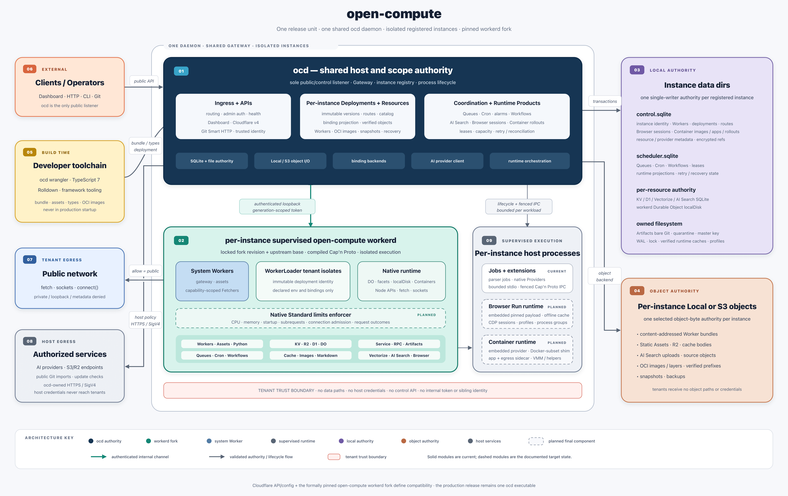

<p align="center">
  <a href="https://open-compute.dev">
    
  </a>
</p>

<p align="center">
  <strong>单二进制、一键部署的高性能 Cloudflare Workers 兼容基础设施。</strong><br/>
  毫秒级冷启动 · MB 级内存占用 · 零额外依赖。
</p>

<p align="center">
  <a href="https://github.com/elliothux/open-compute/actions/workflows/ci.yml">
    
  </a>
  
  
  
  
  
</p>

<p align="center">
  <a href="https://open-compute.dev">官网</a>
  · <a href="docs/README.md">文档</a>
  · <a href="packages/docs">运维站点</a>
  · <a href="docs/implemented/open-compute-workerd-platform.md">架构设计</a>
</p>

<p align="center">
  <a href="README.md">English</a> · 简体中文
</p>

---

## Workers 平台，跑在你自己的硬件上

你已经会写 Cloudflare Workers。**open-compute 让它们原样运行**——同样的 module worker、同样的 binding、
同样的 API——在一台你自己的机器上。

**一个二进制。一个数据目录。一个 S3 endpoint。** 这就是整个平台。

没有 Kubernetes。没有 Redis。没有服务网格。没有需要照看的控制面集群。没有厂商锁定。

```
   别人的方案                            open-compute
   ─────────────                        ────────────
   gateway + router                     ┌──────────────┐
   control plane                        │              │
   scheduler service          ═══>      │  ocd（1 个）  │
   Redis / Valkey 集群                   │              │
   Postgres                             └──────────────┘
   K8s + operators                       + SQLite + S3
```

## 为什么是 open-compute

**workerd 是运行时，不是平台。** 它把 Worker 隔离执行做得极好——然后就到此为止：没有多租户路由、
没有持久状态、没有调度、没有部署生命周期、没有控制 API。任何想在自己基础设施上跑 Workers 的人，
都得自己造这一层。

open-compute **就是这一层**——而且只有**一个文件**。

- **一个二进制，全部在内。** 运行时、控制面、调度器和全部产品 binding。拷到主机上、指向一个目录，就开始对外服务。
- **快，因为它是 workerd。** 你的代码跑在 stock workerd 上——Cloudflare 开源的 V8 运行时。isolate **毫秒级**启动、**MB 级**驻留——不是容器，不是 GB，不是 per-request 起进程。
- **没有别的要运行。** SQLite 是权威状态，任意 S3-compatible 存储放字节。这就是全部依赖清单。
- **绝不 fork。** upstream workerd 被 pin、被校验、原样使用——上游修复和 V8 升级是一次版本号变更，而不是一场合并冲突。
- **完全属于你。** 你的代码、你的数据、你的机器，完全离线。没有账号、没有出网、没有遥测、没有账单。

## 用证据说话

这里的兼容性是测出来的，不是宣称出来的。同一套 fixture 同时跑在 open-compute **和**真实 Cloudflare 上——
结果不一致，就不发布。

| | |
| --- | --- |
| **2,097** | 个 stable API 成员，覆盖 Workers runtime 和全部产品 binding——**零缺口** |
| **7 / 7** | 项产品 surface 与真实 Cloudflare 逐字段核对通过：Workers、Cache、KV、D1、R2、Durable Objects、Queues |
| **1 : 1** | 生产级 Next.js 16 构建产物在 Cloudflare 与 open-compute 上表现一致——同一产物，同一行为 |
| **90%+** | 强制行覆盖率下限，每次验收都跑真实进程、真实 SQLite、真实 workerd |

## 兼容性

编写标准 module worker（`export default { fetch }`），使用你已熟悉的 binding：

| 模块 | 进度 |
| --- | --- |
| Workers | █████████░ 95% |
| KV | █████████░ 95% |
| R2 | █████████░ 95% |
| D1 | █████████░ 95% |
| Durable Objects | █████████░ 95% |
| Queues | █████████░ 95% |
| Cron | █████████░ 95% |
| Workflows | █████████░ 95% |
| Static Assets | █████████░ 95% |
| Service Bindings | █████████░ 95% |
| Cache | █████████░ 95% |
| Images | █████████░ 95% |
| Version Metadata | ██████████ 100% |
| WebSocket Hibernation | ██████████ 100% |
| Cloudflare v4 · Wrangler · Dashboard | 核心已实现；托管端资格单独跟踪 |

剩下的 5% 是单节点的客观现实——全球边缘拓扑与托管 fleet 配额——不是缺方法。
精确支持面：[兼容矩阵](docs/references/cloudflare-compatibility.md) · `ocd capabilities --json`

## 快速开始

本地拉起平台（需要 Rust 1.98、Bun 1.3、Node 24 和 pinned workerd 压缩包——见[文档](docs/references/single-binary.md)）：

```sh
export OPEN_COMPUTE_BUILD_WORKERD_ARCHIVE=/abs/workerd-darwin-arm64.gz
bun run build
./scripts/dev.sh
```

发布你的第一个 Worker：

```sh
CLOUDFLARE_API_BASE_URL=http://127.0.0.1:8787/client/v4 \\
CLOUDFLARE_API_TOKEN="$OPEN_COMPUTE_DEPLOY_TOKEN" \\
CLOUDFLARE_ACCOUNT_ID="$OPEN_COMPUTE_ACCOUNT_ID" \\
bun run oc run --config examples/hello-worker/wrangler.jsonc
```

类型检查、打包、部署、对外服务——一条命令。生产环境更简单：**一个可执行文件、一个配置文件、
一个数据目录。** 主机上不需要构建工具，不需要运行时下载，启动不需要网络。

## 架构

<p align="center">
  
</p>

| 组件 | 职责 |
| --- | --- |
| `ocd` | 整个控制面：入口、控制 API、调度器、supervisor、部署权威 |
| `workerd` | 运行时——pin、摘要校验、原样使用的 upstream |
| SQLite | 本地权威状态——无外部数据库，无最终一致性 |
| S3-compatible | 你选的对象存储——bundle、静态资源、R2 字节 |

租户只拿到自己部署声明的东西——别的一个都没有。没有 SQLite 路径、没有 S3 凭据、没有内部 token、
没有邻居租户。这由能力层强制，而不是靠约定。

### Rust 驱动，为热路径而生

宿主是一个单一的异步 Rust 进程——没有 GC 停顿，没有解释器，从 socket 到你的 Worker 之间没有 sidecar 跳数。

- **全链路异步。** `tokio` 多线程 runtime，`axum` + `hyper` 同时承载两个平面。请求体以 `bytes` 流式穿过，不缓冲整个 payload。
- **`unsafe_code = "forbid"`。** 全 workspace 生效——整个平台是 safe Rust。外加 `missing_docs = "deny"`、`unused_must_use = "deny"`，以及全 target/全 feature 的 Clippy `-D warnings`。
- **release 为速度而编。** 完整 LTO、`codegen-units = 1`、`panic = "abort"`、strip 符号表——一个致密的静态链接产物。
- **状态在进程内。** `rusqlite` 内置 SQLite——事务是函数调用，不是网络往返。外键开启、回调同步、WAL 模式。
- **该省的拷贝都省掉。** 校验过的运行时 payload 按内容寻址、只物化一次，跨重启复用。

### 分层 crate，边界由 CI 强制

依赖方向在 CI 中校验——不会悄悄腐化的架构：

```
core ── storage ── artifacts ── runtime      （同级，底层）
                    └── workers              （可用 core/storage/artifacts，绝不用 runtime）
                          └── service        （组装根：CLI、HTTP、workerd bridge）
```

`ocd` 用已校验的二进制编译 Cap'n Proto 配置，把 workerd 作为受监督子进程拉起，并通过**仅监听回环**的
通道与它通信；per-generation token 永不进入 argv、环境变量或日志。它掌管完整的子进程生命周期：
readiness 探测、进程组、有界输出捕获、优雅与强制停止、回收、重启退避，以及无 secret 的孤儿进程恢复。

部署是**不可变且内容寻址**的。`workerLoader` 的 key 就是部署身份，因此 promote 与 rollback 只是移动
指针——绝不修改已在运行的东西。

## 它不是什么

在生产里，坦白的边界胜过意外：

- **不是 Cloudflare 全球边缘。** 单节点、跑在你自己的基础设施上——没有 Anycast、没有跨地域复制、没有 POP 网络。而正是这个取舍换来了强本地一致性。
- **不是万能 drop-in。** 兼容性逐 surface 跟踪，每一处偏差都写进文档，而不是含糊过去。
- **不是多副本 HA 集群。** 一个数据目录、一个进程、一台机器——这是设计选择。

## 文档

| 目标 | 从这里开始 |
| --- | --- |
| 理解设计 | [架构设计](docs/implemented/open-compute-workerd-platform.md) |
| 查看 API 支持 | [兼容矩阵](docs/references/cloudflare-compatibility.md) |
| 跟踪剩余资格 | [待验收计划](docs/acceptance/README.md) |
| 构建与部署 Worker | [工具链指南](packages/toolchain/README.md) |
| 下载与发版 | [GitHub Releases](https://github.com/elliothux/open-compute/releases) · [发版流程](docs/references/releasing.md) |
| 生产部署 | [单二进制指南](docs/references/single-binary.md) · [容器 / systemd / launchd](examples/) |
| 运维与恢复 | [运维手册](docs/references/README.md#运维手册) · [运维站点](packages/docs) |
| 参与贡献 | [AGENTS.md](AGENTS.md) · [测试策略](docs/references/testing.md) |

## 安全

- 每个数据目录只允许一个 `ocd`——由锁强制，不是靠文档。
- 内部 token 永不出现在 argv、环境变量、日志、status 或 metrics 中。
- 租户出站仅限公网；私有、回环、link-local 和 metadata 地址在地址层直接拒绝。

## 赞助

本项目由 **[Lynx AI](https://lynxai.work)** 赞助。

## License

Apache-2.0。打包的 `workerd` 仍遵循 upstream Cloudflare workerd 许可证。
