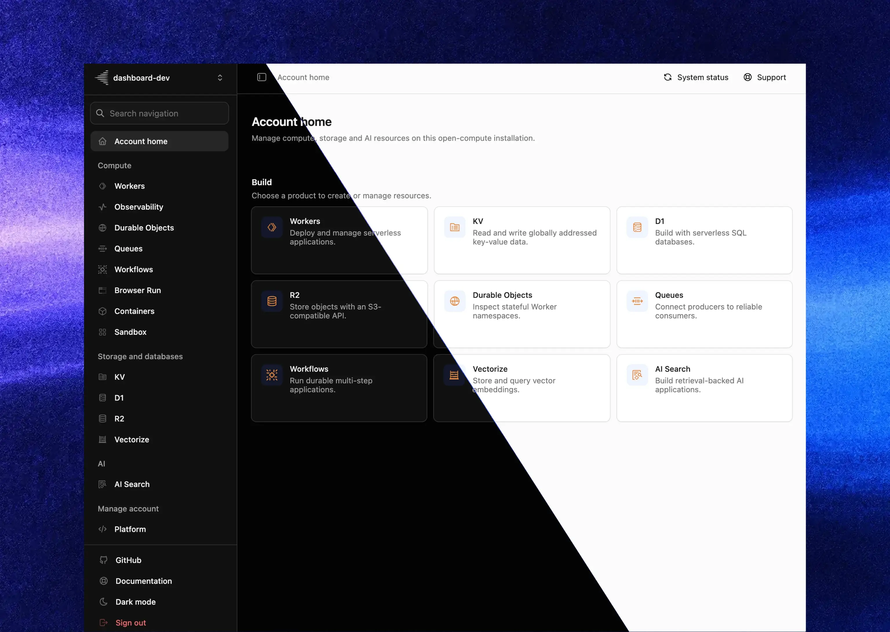

<p align="center">
  <a href="https://open-compute.dev">
    
  </a>
</p>

<p align="center">
  <strong>一个二进制。一个数据目录。</strong><br/>
  在一台自己的机器上运行兼容 Cloudflare Workers 的完整平台。
</p>

<p align="center">
  <a href="https://github.com/elliothux/open-compute/actions/workflows/ci.yml">
    
  </a>
  
  
  
  
  
</p>

<p align="center">
  <a href="https://open-compute.dev/zh/">官网</a>
  · <a href="https://open-compute.dev/zh/docs/">文档</a>
  · <a href="https://open-compute.dev/zh/docs/platform/compatibility/">兼容性</a>
  · <a href="https://open-compute.dev/zh/docs/project/">架构设计</a>
</p>

<p align="center">
  <a href="README.md">English</a> · 简体中文
</p>

---

## Workers 平台，跑在你自己的硬件上

如果你已经会写 Cloudflare Workers，就可以直接使用 open-compute。标准 module Worker、常用 binding 和 Wrangler 工作流都可以保留，只是运行位置换成了你自己的机器。

**一个二进制。一个数据目录。一个对象 authority。** 默认直接使用 Local 文件系统，也可显式选择 S3-compatible 存储。

不需要 Kubernetes、Redis、服务网格或分布式控制面，也不会把数据锁在托管平台里。

```
   别人的方案                            open-compute
   ─────────────                        ────────────
   gateway + router                     ┌──────────────┐
   control plane                        │              │
   scheduler service          ═══>      │  ocd（1 个）  │
   Redis / Valkey 集群                   │              │
   Postgres                             └──────────────┘
   K8s + operators                       + SQLite + Local/S3 objects
```

## 为什么是 open-compute

**workerd 是运行时，不是完整的平台。** 它负责隔离执行 Worker，但不提供多租户路由、持久状态、调度、部署生命周期或控制 API。要在自己的基础设施上运行 Workers，这一层仍然需要有人来实现。

open-compute 补上了这一层，并把它交付为一个文件。

- **一个二进制，组件都在里面。** 运行时、控制面、调度器和产品 binding 随同一个文件交付。把它复制到主机并指定数据目录，就可以开始运行。
- **使用 workerd 执行 Worker。** Worker 运行在固定版本、校验摘要的 workerd fork 中。isolate 可在毫秒级启动，不必为每个请求创建进程或容器。
- **不需要配套服务。** SQLite 保存平台元数据；对象默认写入本地文件系统，也可以切换到 S3-compatible 存储。两种方式都不需要额外的数据库或缓存 sidecar。
- **运行时固定且可验证。** runtime 及其资源会在构建和启动时校验，生产环境启动时不需要联网。
- **代码和数据留在自己的机器上。** 外部服务都是可选项，只有显式配置后才会使用。

## 用证据说话

兼容性以测试结果为准。只要 Cloudflare 托管 API 允许直接对照，同一组请求就会分别发送到 open-compute 和真实 Cloudflare 环境。

|           |                                                                                                                                         |
| --------- | --------------------------------------------------------------------------------------------------------------------------------------- |
| **2,256** | 个 stable API member 和 overload，覆盖 Workers runtime 与产品 binding                                                                   |
| **10**    | 个产品 surface 与真实 Cloudflare 逐请求对照：Workers、Cache、KV、D1、R2、Durable Objects、Queues、Vectorize、AI Search 和 Observability |
| **90%+**  | 行覆盖率下限；验收测试使用真实进程、SQLite 和固定版本的 workerd runtime                                                                 |

## 兼容性

编写标准 module worker（`export default { fetch }`），使用你熟悉的 binding。准确行为和单机差异见[兼容性指南](https://open-compute.dev/zh/docs/platform/compatibility/)。

### 运行时与 binding

| 模块                    | 状态              |
| ----------------------- | ----------------- |
| Workers                 | █████████▉ 99% ✅ |
| Workers Standard limits | █████████▉ 99% ✅ |
| KV                      | █████████▉ 99% ✅ |
| R2                      | █████████▉ 99% ✅ |
| D1                      | █████████▉ 99% ✅ |
| Durable Objects         | █████████▉ 99% ✅ |
| Alarms                  | █████████▉ 99% ✅ |
| Queues                  | █████████▉ 99% ✅ |
| Cron                    | █████████▉ 99% ✅ |
| Workflows               | █████████▉ 99% ✅ |
| Static Assets           | █████████▉ 99% ✅ |
| Service Bindings        | █████████▉ 99% ✅ |
| Cache                   | █████████▉ 99% ✅ |
| Images                  | █████████▉ 99% ✅ |
| Version Metadata        | █████████▉ 99% ✅ |
| WebSocket Hibernation   | █████████▉ 99% ✅ |
| Vectorize               | █████████▉ 99% ✅ |
| Markdown Conversion     | █████████▉ 99% ✅ |
| AI Search               | █████████▉ 99% ✅ |
| Artifacts               | █████████▉ 99% ✅ |
| Dynamic Workers         | █████████▉ 99% ✅ |

### 管理面

| 表面                         | 状态                                                                 |
| ---------------------------- | -------------------------------------------------------------------- |
| Cloudflare v4 API            | █████████░ 90% — 本地 `/client/v4` 可与 Wrangler 及官方 SDK 配合使用 |
| Wrangler                     | █████████▉ 99% ✅ — Wrangler `4.138.0` 可部署和管理已支持产品        |
| Dashboard                    | ████████░░ 80% — 基于同一套 `/client/v4` API 的 operator UI          |
| Workers Logs / realtime tail | █████████░ 90% — 单机 logs、query、`wrangler tail` 与 live tail      |

### 部分支持

| 模块       | 状态                                                 |
| ---------- | ---------------------------------------------------- |
| Workers AI | ██░░░░░░░░ 20% — 仅 Markdown Conversion 与 AI Search |

### 规划中

设计进行中，尚不可部署对应 binding / API。

| 模块        | 状态                      |
| ----------- | ------------------------- |
| Browser Run | ██░░░░░░░░ 20% — 规划中。 |
| Containers  | ██░░░░░░░░ 20% — 规划中。 |

### 尚未支持

依赖这些能力的上传或配置会 fail closed。

| 模块                            | 状态                       |
| ------------------------------- | -------------------------- |
| 通用 Workers AI inference       | ░░░░░░░░░░ 0% — 尚未支持。 |
| Hyperdrive                      | ░░░░░░░░░░ 0% — 尚未支持。 |
| Analytics Engine                | ░░░░░░░░░░ 0% — 尚未支持。 |
| Workers for Platforms           | ░░░░░░░░░░ 0% — 尚未支持。 |
| Pipelines                       | ░░░░░░░░░░ 0% — 尚未支持。 |
| Rate Limiting                   | ░░░░░░░░░░ 0% — 尚未支持。 |
| mTLS certificates               | ░░░░░░░░░░ 0% — 尚未支持。 |
| Tail Workers / traces / Logpush | ░░░░░░░░░░ 0% — 尚未支持。 |

Cloudflare 的 API 非常纷繁复杂。**99% ✅ 表示文档列出的 public API 已完全对齐，但不承诺所有细节行为都与 Cloudflare 完全一致。** open-compute 仍处于早期阶段；如果遇到未与 Cloudflare 对齐的行为，欢迎[提交 issue](https://github.com/elliothux/open-compute/issues/new)。单机差异见[兼容性指南](https://open-compute.dev/zh/docs/platform/compatibility/)。运行中能力：`ocd capabilities --json`。

## 快速开始

### 让 AI coding agent 完成安装

把下面这段提示复制到 Codex、Claude Code 或其他 coding agent：

```text
阅读 https://open-compute.dev/llms.txt，在这台机器上安装 open-compute 当前正式版本并配置一个本机 instance。先检查已有安装，默认保留现有配置和 instance 数据；使用 sudo 或执行破坏性操作前先询问我。最后运行 ocd status，并报告结果。
```

[`llms.txt`](https://open-compute.dev/llms.txt) 提供最简安装和使用说明，并在需要时链接到详细文档。

### 手动安装

为当前用户安装正式版本，创建默认的用户级 instance，并启动随登录会话运行的 service：

```sh
curl -fsSL https://open-compute.dev/install.sh | sh
ocd setup --yes
ocd status
ocd dashboard
```

需要登录前启动的整机 service 时，显式选择 system scope：

```sh
curl -fsSL https://open-compute.dev/install.sh | sudo sh
sudo ocd setup --system --yes
```

Wrangler 继续作为 Worker 项目的本地 dependency。本地开发直接使用 Wrangler，部署到 open-compute 时使用 `ocd wrangler`：

```sh
npm install --save-dev wrangler@4.138.0
npx wrangler dev
ocd wrangler deploy
```

生产环境仍然只需要**一个发布二进制、一个配置和一个数据目录**。runtime payload 已内嵌并经过校验；daemon 启动时不会下载 workerd，也不会在 `PATH` 中查找它。

完整安装流程以及 remote target、CI、environment、tail 和 rollback 见[快速开始](https://open-compute.dev/zh/docs/get-started/)与[开发应用](https://open-compute.dev/zh/docs/develop/)。

## 架构

<p align="center">
  
</p>

| 组件                      | 职责                                                                       |
| ------------------------- | -------------------------------------------------------------------------- |
| `ocd`                     | 控制面：入口、API、调度器、supervisor 与部署 authority                     |
| `workerd`                 | 固定并校验摘要的 Worker runtime                                            |
| SQLite                    | 本机权威状态——无外部数据库，无最终一致性                                   |
| Local / S3 对象 authority | bundle、静态资源、R2、Artifacts、snapshot、backup、cache body 与 AI source |

租户只能访问部署中明确声明的能力。SQLite 和本地对象路径、S3 凭据、内部 token 以及其他租户都不会进入 Worker 环境。这些限制由能力层执行，不依赖使用约定。

### Rust 实现的请求链路

宿主是一个异步 Rust 进程。请求从 socket 到 Worker 之间不经过解释器，也不需要额外的 sidecar 转发。

- **全链路异步。** `tokio` 多线程 runtime，`axum` + `hyper` 同时承载两个平面。请求体以 `bytes` 流式穿过，不缓冲整个 payload。
- **`unsafe_code = "forbid"`。** 全 workspace 生效——整个平台是 safe Rust。外加 `missing_docs = "deny"`、`unused_must_use = "deny"`，以及全 target/全 feature 的 Clippy `-D warnings`。
- **release 为速度而编。** 完整 LTO、`codegen-units = 1`、`panic = "abort"`、strip 符号表——一个致密的静态链接产物。
- **进程内状态。** `rusqlite` 将 SQLite 内嵌到 `ocd`；事务是函数调用，不是网络往返。外键保持开启，WAL 由本机持有。
- **该省的拷贝都省掉。** 校验过的运行时 payload 按内容寻址、只物化一次，跨重启复用。

### 分层 crate，依赖边界由 CI 检查

CI 会校验 crate 的依赖方向：

```
core ── storage ── artifacts ── runtime      （同级，底层）
                    └── workers              （可用 core/storage/artifacts，绝不用 runtime）
                          └── service        （组装根：CLI、HTTP、workerd bridge）
```

`ocd` 编译 runtime config，把 workerd 作为受监督 child 拉起，并通过**仅监听回环**的通道通信。它负责 readiness、
优雅停止、重启退避与恢复。

部署内容不可变，并按内容寻址。`workerLoader` 的 key 就是部署身份，因此 promote 和 rollback 只会移动指针，不会修改已经运行的内容。

## Dashboard

<p align="center">
  
</p>

Dashboard 用于管理 `/client/v4` 已开放的计算、存储、AI 和平台资源，也可以在当前 `ocd` daemon 登记的 instance 之间切换。

## 原生扩展

当 Worker 需要访问本机硬件、私有库或内部 daemon 时，运维人员可以注册一个原生扩展。每个扩展由一个原生 Provider 进程和一层轻量 JavaScript facade 组成，并通过普通 Wrangler `services` binding 暴露给 Worker。

- **不增加新的 Binding 类型。** Worker 看到的仍然是标准 Service Binding；每个 binding 的配置放在 `props` 中。
- **数据直接传输。** `ocd` 完成 session 认证后，由 workerd 和 Provider 通过 Cap'n Proto 直接通信。
- **默认拒绝越界访问。** session identity、Provider 路径和平台句柄不会进入租户代码、argv 或日志。

[扩展教程](https://open-compute.dev/zh/docs/extension/tutorial/)介绍了完整实现过程。仓库中也提供了一个小型 Rust [参考 Provider](crates/service/src/bin/host_extension_test_provider/main.rs)。

## 适用边界

- **不提供 Cloudflare 的全球边缘网络。** open-compute 运行在你自己的单节点基础设施上，没有 Anycast、跨地域复制或 POP 网络。对应的好处是本机状态保持强一致。
- **并非所有 Cloudflare 产品都可以直接替换。** 兼容性按 surface 跟踪，已知差异会明确记录在文档中。
- **不是多副本 HA 集群。** 一个数据目录、一个进程、一台机器是当前明确的部署模型。

## 文档

| 目标              | 从这里开始                                                                                                                                       |
| ----------------- | ------------------------------------------------------------------------------------------------------------------------------------------------ |
| 理解设计          | [架构与项目指南](https://open-compute.dev/zh/docs/project/)                                                                                      |
| 查看 API 支持     | [兼容性](https://open-compute.dev/zh/docs/platform/compatibility/) · [Worker API 索引](https://open-compute.dev/zh/docs/platform/reference/api/) |
| 查看未支持能力    | [未提供能力](https://open-compute.dev/zh/docs/platform/unsupported/)                                                                             |
| 构建与部署 Worker | [开发应用](https://open-compute.dev/zh/docs/develop/)                                                                                            |
| 下载与发版        | [GitHub Releases](https://github.com/elliothux/open-compute/releases) · [项目指南](https://open-compute.dev/zh/docs/project/)                    |
| 生产运行          | [快速开始](https://open-compute.dev/zh/docs/get-started/) · [运行与运维](https://open-compute.dev/zh/docs/operate/)                              |
| 运维与恢复        | [运行与运维](https://open-compute.dev/zh/docs/operate/) · [事故处理](https://open-compute.dev/zh/docs/ocd/incidents/current-release/)            |
| 参与贡献          | [项目指南](https://open-compute.dev/zh/docs/project/) · [AGENTS.md](AGENTS.md)                                                                   |

## 安全

- 每个数据目录只允许一个 `ocd`——由锁强制，不是靠文档。
- 内部 token 永不出现在 argv、环境变量、日志、status 或 metrics 中。
- 租户出站仅限公网；私有、回环、link-local 和 metadata 地址在地址层直接拒绝。

## 赞助

本项目由 [Lynx AI](https://lynxai.work) 赞助。

## 许可证

Apache-2.0。打包的 open-compute workerd fork 仍遵循适用的 upstream Cloudflare workerd 许可证。
